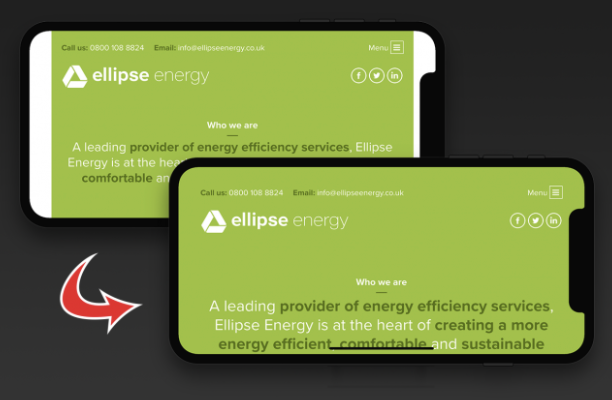

# head 标签内的那些事

## title

定义网页的标题

```html
<title>Title</title>
```

## style

定义元素的 css 样式

```html
<style></style>
```

## link

### DNS 预解析

```html
<link rel="dns-prefetch" href="//api.xxx.com" />
```

### 加载 css 文件

```html
<link rel="stylesheet" href="styles/xxx.css" />
```

### preload 预加载

HTML 解析器解析的顺序是 解析->请求资源->解析->请求资源->解析...
我们可以一开始就将所有的资源都请求回来，减少中途请求资源的时间。

预加载器通过浏览器对 HTML 文档的早期解析找到可能包含资源的标签并且将 URL 收集起来，根据不同类型的不同优先级进行有序的加载资源。

大多数基于标记语言的资源能够被浏览器的预加载器发现，但是总有一些资源不是基于标记语言的，所以可以手动进行设置。

以下标签告诉浏览器，这个资源等下会用到，请预先加载。加载后触发 onload 事件，将 rel 改成 stylesheet，就会像正常加载 css 一样对该文件进行构建成 CSSOM。preload 的资源没有加载完成不会阻塞页面。
通过 as 得知当前的类型，就可以根据资源的类型匹配对应的优先级。

```html
<link rel="preload" href="xxx.min.css" as="style" onload="this.onload=null;this.rel='stylesheet'" />
```

## script

编写 JavaScript 代码

```html
<script type="text/javascript">
  document.write('<h1>Hello World!</h1>');
</script>
```

引入 JavaScript 文件

```html
<script type="text/javascript" src="myscripts.js"></script>
```

## noscript

早期有些浏览器不支持 JavaScript，可以使用该标签显示替代内容。

```html
<noscript>
  <p>本页面需要浏览器支持（启用）JavaScript</p>
</noscript>
```

## meta

meta 标签主要是提供相关页面的元数据，元数据可以提供给浏览器、搜索引擎等调用。通常以 **名称 / 值** 对出现。

### application-name

页面应用程序的名字

```html
<meta name="application-name" content="App Name" />
```

### author

作者的名字

```html
<meta name="author" content="zoe" />
```

### description

页面的描述 搜索引擎会显示在搜索结果中

```html
<meta name="description" content="Free web tutorials" />
```

### generator

说明生成该文档的软件包是什么

```html
<meta name="generator" content="FrontPage 4.0" />
```

### keywords

逗号分隔的关键词列表，告诉浏览器该页面与什么相关。

```html
<meta name="keywords" content="HTML, meta tag, tag reference" />
```

### apple-mobile-web-app-capable

是否删除苹果默认的工具栏和状态栏，默认是 no，不删除。

```html
<meta name="apple-mobile-web-app-capable" content="yes|no" />
```

### apple-mobile-web-app-status-bar-style

设置状态栏的颜色

```html
<meta name="apple-mobile-web-app-status-bar-style" content="default" />
```

### format-detection

格式检测，例如一段没有样式没有链接的数字会被设置成链接，点击就会进行拨号。

```html
<meta name="format-detection" content="telephone=no,email=no,adress=no" />
```

### msapplication-tap-highlight

点击是否有高亮，no 为无高亮。

```html
<meta name="msapplication-tap-highlight" content="no" />
```

### robots

定义该文档以及链接的检索规则
四种组合

- index,follow
- index，nofollow
- noindex，follow
- noindex，nofollow

简易表达方式

- index,follow == all
- noindex,nofollow == none

```html
<meta name="robots" content="all|none|index|noindex|follow|nofollow" />
```

### viewport

#### initial-scale

设置页面的初始缩放值，为一个数字，可以带小数。

#### minimum-scale

允许用户的最小缩放值，为一个数字，可以带小数。

#### maximum-scale

允许用户的最大缩放值，为一个数字，可以带小数。

#### user-scalable

是否允许用户进行缩放，值为"no"或"yes", no 代表不允许，yes 代表允许。

#### minimal-ui

iOS 7.1 的 Safari 为 meta 标签新增 minimal-ui 属性，在网页加载时隐藏地址栏与导航栏，这个在 iOS8 中已经废弃了。

#### viewport-fit

解决 iphone 刘海屏的问题，设置 background 和 viewport-fit 即可覆盖。



#### 总体代码

```html
<meta
  name="viewport"
  content="width=device-width, 
           initial-scale=1, 
           maximum-scale=1, 
           minimum-scale=1, 
           user-scalable=no, 
           minimal-ui, 
           viewport-fit=cover"
/>
```

### http-equiv

#### content-type

```html
<meta http-equiv="content-type" content="text/html; charset=UTF-8" />
```

HTML4.01 定义文档的字符编码的方式即如上的方式，但是 HTML5 开始新增了一个 charset 字段，更加方便定义字符编码方式。

```html
<meta charset="utf-8" />
```

#### default-style

```html
<meta http-equiv="default-style" content="preferred stylesheet" />
```

#### refresh

定义文档自动刷新的间隔

```html
<meta http-equiv="refresh" content="300" />
```

#### pragma/cache-control/expires

设置页面不缓存

```html
<meta http-equiv="”pragma”" content="”no-cache”" />
<meta http-equiv="cache-control" content="no-cache" />
<meta http-equiv="expires" content="0" />
```
