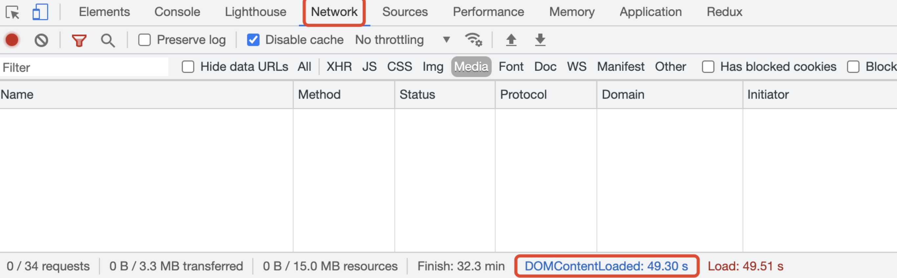
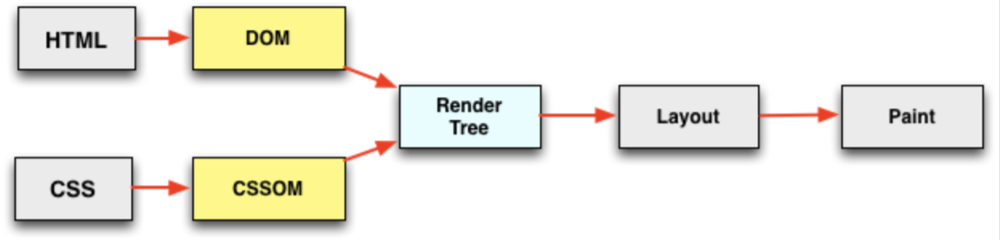

# 一文说清 DOMContentLoade 和 Load

在控制面板 Network 中可以看到 DOMContentLoaded 和 Load 两个事件被触发所需要的时间。



## 事件被触发的大概时机

### DOMContentLoaded

浏览器向服务器发送请求获得 HTML 文档，就需要对 HTML 文档进行解析，当 HTML 文档被解析成 DOM，就会触发，并不需要等待 CSS 样式表或者图片等资源的加载，但是同步的 JavaScript 会阻塞 HTML 解析，会间接的延迟 DOMContentLoaded 触发的时间。

## Load

所有的资源被加载完成后触发，包括 CSS 样式表、JavaScript 脚本文件、图片等，

Load 比较好判断，下面只讨论 DOMContentLoaded 被触发的时机。

## DOMContentLoaded 具体触发时机

### CSS

如下 CSS 样式表是不会阻塞 HTML 解析的，所以不需要等待 CSS 文件下载和解析就会触发 DOMContentLoaded。

```html
<link rel="stylesheet" href="https://xxx.css" />
```

### CSS + JavaScript

如下 JavaScript 脚本文件会阻塞 HTML 解析(因为 JavaScript 可能要去获取 DOM)，而 JavaScript 脚本需要等待脚本前的 CSS 文件加载并解析(因为 JavaScript 可能要获取样式)，所以需要等待 JavaScript 脚本加载和执行以及 CSS 加载和执行。

```html
<link rel="stylesheet" href="https://xxx.css" />
```

```html
<script>
  console.log('sujie2');
</script>
```

### CSS + defer JavaScript

defer 表示在 HTML 解析过程中如果遇到 defer 不会停止解析，交给后台去下载脚本。
根据下载脚本的时间不同，可能有如下顺序：

- HTML 解析完成 -> defer 加载完成并执行 defer 脚本 -> DOMContentLoaded -> 渲染页面
- HTML 解析完成 -> 渲染页面 -> defer 加载完成并执行 defer 脚本 -> DOMContentLoaded

defer 脚本一定会在 DOMContentLoaded 之前执行，但是未必在页面渲染之前执行。

```html
<link rel="stylesheet" href="https://xxx.css" />
```

```html
<script defer src="https://xxx.js"><script>
```

### CSS + async JavaScript

async 表示在 HTML 解析过程中如果遇到 async 不会停止解析，交给后台去下载脚本。
根据下载脚本的时间不同，可能有如下顺序：

- HTML 解析中 -> async 提前加载完成于是停止 HTML 解析并执行 async 脚本 -> HTML 解析完成 -> DOMContentLoaded - 渲染页面
- HTML 解析完成 -> DOMContentLoaded -> 渲染页面 > async 加载完成并执行 async 脚本

与 defer 的不同在于，async 不一定会在 DOMContentLoaded 之前执行。

```html
<link rel="stylesheet" href="https://xxx.css" />
```

```html
<script async src="https://xxx.js"><script>
```

### DOMContentLoaded 和白屏时间的关系

DOMContentLoaded 只是表示 HTML 被加载解析完成，而白屏时间则是计算页面有内容出现需要花费的时间，两者没有必然的联系。

例如只有 CSS 的情况，DOMContentLoaded 的时间会比白屏时间短，因为 CSS 不会阻塞 HTML 解析，但是会阻塞页面渲染(如果不阻止渲染，当 HTML 解析完成后就直接渲染，然后 CSS 加载解析就会触发回流或者重绘，造成没有必要的消耗)。

例如有 CSS 和 JavaScript 的情况，两者时间就差不多，白屏稍微长一点，因为都需要等待 HTML 解析、CSS 解析、JavaScript 加载和执行，只是渲染流程会长一点，如图所示。



## 总结

- CSS

  - CSS 不会阻塞 HTML 解析
  - CSS 会阻塞 JavaScript 脚本执行
  - CSS 会阻塞渲染

- JavaScript

  - JavaScript 会阻塞 HTML 解析
  - defer JavaScript 不会阻塞 HTML 解析，但是会在 DOMContentLoaded 之前执行。
  - async JavaScript 不会阻塞 HTML 解析，不一定在 DOMContentLoaded 之前执行，取决于什么时候下载完成，但是一般 HTML 解析速度比脚本下载速度快。

- DOMContentLoaded 取决于 HTML 是否解析完成
- Load 取决于资源是否全部加载
- 白屏时间取决于 HTML 是否解析完成、CSS 是否解析完成
