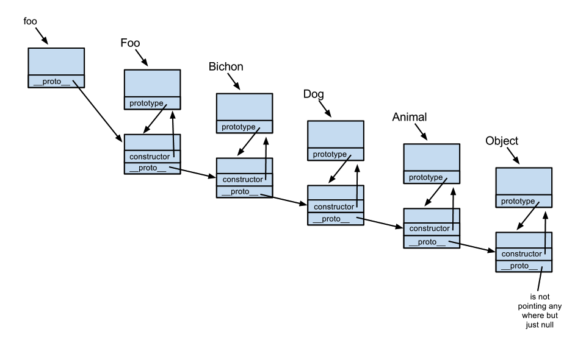
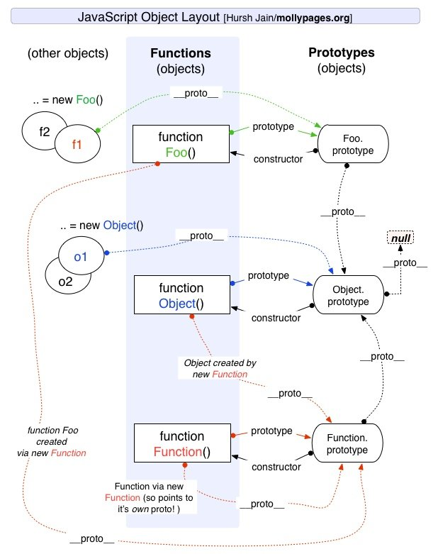
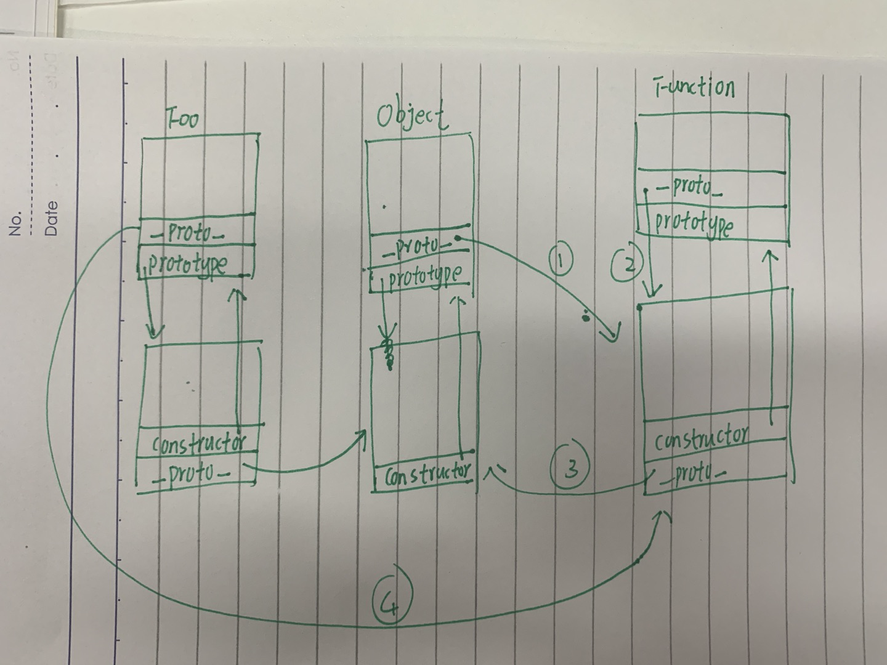

# 原型链

## 井然有序的原型链



- prototype 表示构造器 Foo 以该原型为模板去创建实例。
- \_\_proto\_\_ 表示该实例的原型。
  但是在这里提出两个疑问

  **问题 1：**
  构造器的\_\_proto\_\_是谁？例如 Foo、Object，是如何创造出来的？

  **问题 2：**
  如果构造器的\_\_proto\_\_是 Function.prototype,Function.prototype 的\_\_proto\_\_是谁,Function.prototype 是如何创造出来的?

## Function 和 Object 的关系



这个图看着有点复杂 画了一个自己的版本 其实比起上图的关系 多了 3、4 条线。1、2 和 3 和 4 是一样的，都是构造器的\_\_proto\_\_指向谁。



以上的两条线即解决刚刚提出的两个问题。

**回答 1:**
构造器的\_\_proto\_\_是 Function 的原型

**回答 2：**
Function 的原型的\_\_proto\_\_是 Object 的原型

ps:注意原型链的终端是 null,即 Object.prototype.\_\_proto\_\_== null

但是由问题 1 引发鸡生蛋 蛋生鸡的问题，如下。

**问题 3：**
构造函数是 Function 构造器生成的，那 Function 构造器是怎么来的？ 即鸡(Function 构造器)生蛋(Function 构造器)？

## 实例之间的关系

主要是多了两条规则。

注意：如果 a 是 b 的实例 则 a.\_\_proto\_\_ = b.prototype。

1、构造函数是 Function 的实例 所以构造函数的\_\_proto\_\_指向 Function 的原型。（1，2，4）

2、Function 的原型是 Object 的实例，所以 Function 的原型的\_\_proto\_\_指向 Object 的原型。(3)

```js
foo instanceof Foo; // true
Foo instanceof Function; // true
Function.prototype instanceof Object; // true
// Object 是 Object 的实例
Object instanceof Object; // true（Object.\_\_proto\_\_.\_\_proto\_\_ === Object.prototype）
// Object 是 Function 的实例
Object instanceof Function; // true（Object.\_\_proto\_\_ === Function.prototype）
// Function 是 Object 的实例
Function instanceof Object; // true（Function.\_\_proto\_\_.\_\_proto\_\_ === Object.prototype）
// Function 是 Function 的实例
Function instanceof Function; // true（Function.\_\_proto\_\_ === Function.prototype）
```

鸡生蛋 蛋生鸡问题
// Function 是 Function 的实例
Function instanceof Function
Function.\_\_proto\_\_ === Function.prototype

此处争论点在于 Function 对象是不是由 Function 构造函数创建的一个实例？

**解释 1：**
YES：按照 JavaScript 中“实例”的定义，a 是 b 的实例即 a instanceof b 为 true，默认判断条件就是 b.prototype 在 a 的原型链上。而 Function instanceof Function 为 true，本质上即 Object.getPrototypeOf(Function) === Function.prototype，正符合此定义。

**解释 2、**
NO：Function 是 built-in 的对象，也就是并不存在“Function 对象由 Function 构造函数创建”这样显然会造成鸡生蛋蛋生鸡的问题。实际上，当你直接写一个函数时（如 function f() {} 或 x => x），也不存在调用 Function 构造器，只有在显式调用 Function 构造器时（如 new Function('x', 'return x') ）才有。

倾向于把 Function.\_\_proto\_\_ 指向 Function.prototype 是为了保证原型链的完整，让 Function 可以获取定义在 Object.prototype 上的方法。

## 作用域链和原型继承查找时的区别

- 如果去查找一个普通对象的属性，但是在当前对象和其原型中都找不到时，会返回 undefined。但查找的属性在作用域链中不存在的话就会抛出 ReferenceError。
- prototype 是函数才有的属性 但不是所有的函数都有的属性
  - 函数作为构造函数（有）
  - 函数作为普通函数（有）
  - 原型函数（没有）
- \_\_proto\_\_是实例拥有的属性，可以用 A instanceof B 来判断 A 是否是 B 的实例。
  - 例如此处 foo 是 Foo 的实例，因为 foo.\_\_proto\_\_ === Foo.prototype。
- \_\_proto\_\_ 属性在 ES6 时才被标准化
  - 以确保 Web 浏览器的兼容性，但是不推荐使用，除了标准化的原因之外还有性能问题。为了更好的支持，推荐使用 Object.getPrototypeOf()。

通过改变一个对象的 [[Prototype]] 属性来改变和继承属性会对性能造成非常严重的影响，并且性能消耗的时间也不是简单的花费在 obj.\_\_proto\_\_ = ... 语句上, 它还会影响到所有继承自该 [[Prototype]] 的对象，如果你关心性能，你就不应该修改一个对象的 [[Prototype]]。

如果要读取或修改对象的 [[Prototype]] 属性，建议使用如下方案，但是此时设置对象的 [[Prototype]] 依旧是一个缓慢的操作，如果性能是一个问题，就要避免这种操作。

```js
// 获取
Object.getPrototypeOf();
Reflect.getPrototypeOf();
```

```js
// 修改
Object.setPrototypeOf();
Reflect.setPrototypeOf();
```

- 如果要创建一个新对象，同时继承另一个对象的 [[Prototype]] ，推荐使用 Object.create()。
  - 引用类型 constructor 属性值是可以修改的，但是对于基本类型来说是只读的，当然 null 和 undefined 没有 constructor 属性。
- 不要使用 Bar.prototype = Foo，因为这不会执行 Foo 的原型，而是指向函数 Foo。
- 原型链的构建是依赖于 prototype 还是 \_\_proto\_\_?
  - \_\_proto\_\_

## 参考

[深入探究 Function & Object 鸡蛋问题](https://juejin.cn/post/6844904096827195399)
[面试专题总结：原型和原型链](https://juejin.cn/post/6844904096827195399)
